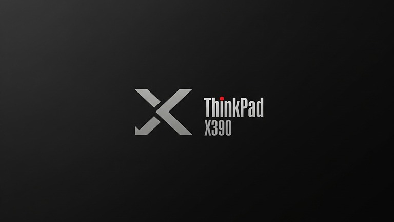
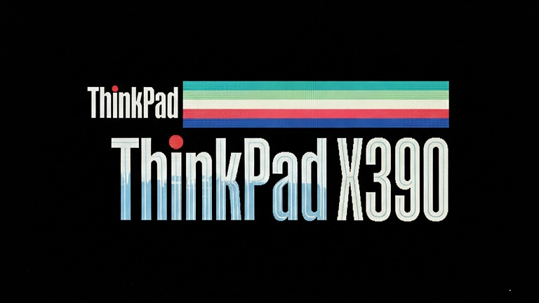
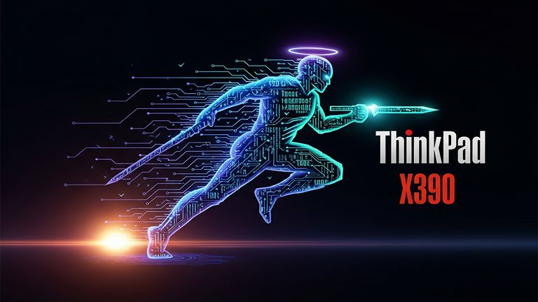
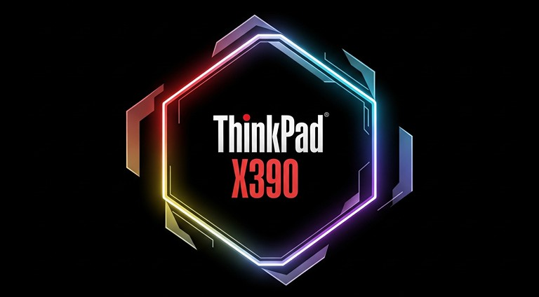
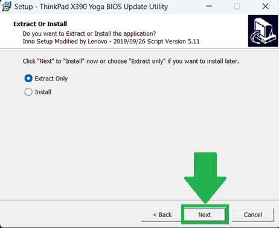
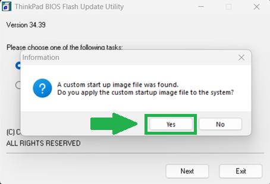

# BootifulThinkpad
A lightweight toolkit for customizing the boot logo and startup screen on Lenovo ThinkPad devices. Easily swap out the default branding for something uniquely yours using image tweaks, BIOS tools, and clear instructions.

# 🎨 Customize Your ThinkPad Startup with a Fresh Boot Logo

Give your **Lenovo ThinkPad (e.g., X390 and other models)** a personalized touch from the moment you power it on with a **custom boot logo**. This guide includes several design ideas — from sleek and modern to retro-inspired — along with the **technical specifications** needed for a smooth transition from the stock red Lenovo splash screen.

---

## 🛠️ Technical Specifications

Before crafting your custom boot logo, make sure it meets the following **compatibility requirements**, which are generally applicable to most modern ThinkPads:

- **File Format:** `JPG`, `GIF`, or `BMP`
- **File Size:** ≤ `60KB`
- **Resolution:** Max `768 x 432` pixels  
  *(40% of the X390's 1920x1080 display resolution)*

---

## 🎨 Design Concepts

Get inspired by one of these themed boot logo ideas:

### 1. 🧼 The Minimalist

> Clean. Bold. Timeless.



- **Concept:** Monochrome `X390` text in a modern sans-serif font, with a subtle stylistic twist (e.g., slanted or broken "X").
- **Colors:** White on black

---

### 2. 🕹️ The Retro ThinkPad Homage

> A nod to the original IBM ThinkPad legacy.



- **Concept:** The vintage multi-colored **IBM-style ThinkPad** logo
- **Colors:** Red, green, blue on black

---

### 3. 👨‍💻 The Code Warrior

> For developers who breathe terminal commands.



- **Concept:** Simulated command line:  
  ```
  Booting X390...
  ▋
  ```
- **Colors:** Green or amber on black (like classic CRT terminals)

---

### 4. 🧳 The Corporate Maverick

> Subtle elegance meets individual flair.



- **Concept:** Personal initials or logo in a professional font, possibly with a faint geometric background pattern
- **Colors:** Silver, deep blue on dark gray

---

## 🔄 How to Change the Boot Logo

You can use Lenovo’s BIOS update utility to set a custom boot logo.

### ✅ Step-by-Step Instructions

1. **Download the BIOS Update**  
   Visit [Lenovo Support](https://support.lenovo.com) and grab the latest BIOS update for your **ThinkPad model**

2. **Prepare Your Logo Image**  
   - Ensure it meets all technical specs (format, size, resolution)
   - Name it `logo.jpg`, `logo.gif`, or `logo.bmp`

3. **Run the BIOS Update Utility**  
   - Launch the downloaded BIOS updater
   - Choose Extract Only
   - 
   - Place your **boot logo image** in the extracted folder
   - When prompted, select the option to apply a **custom startup image**
   - 
   - Select your prepared logo file

---

> ⚠️ **Disclaimer:**  
Modifying BIOS settings can be risky. Ensure you are using the **correct BIOS update for your exact model**. Follow all instructions carefully, and always **back up important data** before proceeding.

---

Enjoy your customized boot-up experience! 🚀
